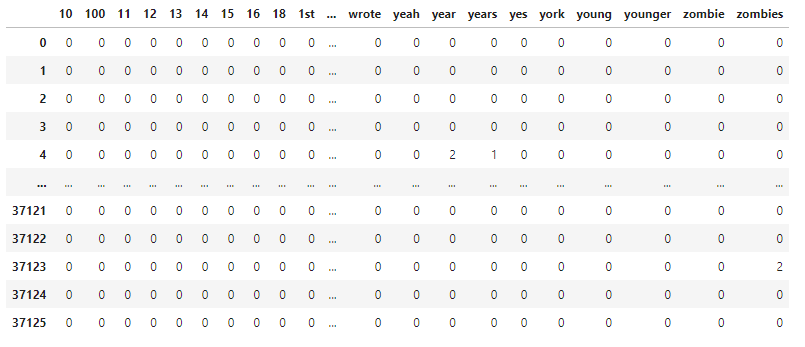

# CS105 Final Project - Creating a Simple Neural Network

Members:
* Jackson Hoke
* Jason Houang
* Ayush Nabar
* Nathan Ng
* Sumachai Suksanguan

Project Repo: [GitHub](https://github.com/ssumachai/CS105-FinalProject)

## Introduction

As we get busier and busier, we have less time to decide if things are good.  Movies in particular thrive from word-of-mouth from others and critic reviews.  Strongly worded reviews help distringuish a movie and give viewers something to look forward to.  We are building a simple neural network utilizing a bag-of-words model to create the necessary features from a collection of Amazon reviews.  The neural network will use each word in the review as features, while each row is a separate sentence to predict movie review star ratings.

## Goal

To predict the star ratings (0 - 5) of a review.

## Data
Amazon product data obtained from [here](jmcauley.ucsd.edu/data/amazon).  The data used was reviews from Amazon Instand Video, which contained information such as `reviewerID`, `asin`, `reviewerName` and others, but for the sake of this project we are focusing mainly on:
* `reviewText`: Sentence-form review of the video. 
* `overall`: Rating of the review in integer star format.

## Tools Used

* Skikit Learn
* Matplotlib
* Pandas
* Numpy 

## Pre-processing

In order to even create such a network, we need to clean the data to look solely at those words.

```py
reviews = pd.read_json('reviews_Amazon_Instant_Video_5.json', lines=true)       # Read in Our Data

vectorizer = CountVectorizer(stop_words='english', min_df=100)                  # Uses Stop Words to remove filler "English Words"

cdf = vectorizer.fit_transform(reviews['reviewText'])                           # Runs vectorizer on our review text
```

Using these above functions allows us to read in our data, then process our data with `CountVectorizer`.  `CountVectorizer` takes in multiple parameters to help with further cleaning the data including:
* `stop_words='english'`: Removes all instances of known-english stop words (i.e, Filler Words)
* `min_df=100`: Ignores terms that have a frequency strictly lower than our given threshold, 100.

After we run initial cleaning, we can use the vectorizer to create our Bag-Of-Words model:
```py
bag = pd.DataFrame(cdf.toarray(), columns=vectorizer.get_feature_names_out())
```

Initial Bag-of-Words Model will look like this:



## Data Analysis and Manipulation (Jackson and Nathan)

Now it's time to actually create our neural network.

```py
x = bag.values                  # Our Bag-of-Words model
y = reviews['overall'].values   # User Rating for the Film they are reviewing

x_train, x_test, y_train, y_test = train_test_split(x, y, test_size=0.2, random_state=42)
```

Use the given `test_train_splits()` function to create our the basis of our neural networking, designating these particular parameters:
* `test_size=0.2`: 20% of the data will be testing
* `random_state=42`: Seed value so that we can replicate our results in testing

Now, we can actually create our neural network!  A common tactic is to utilize a **Multi-Layered Perceptron (MLP)** to find the weights for our regression. 

```py
mlp = MLPRegressor(hidden_layer_sizes=(8,8,8), activation='relu', solver='adam', max_iter=500)
```

The MLP Regressor takes these parameters in order to create our network:
* `hidden_layer_sizes=(8,8,8)`: Represents the number of neurons in the ith hidden layer
* `activation='relu'`: Uses `relu` as the activation function, returning `f(x) = max(0,x)` by using a rectified linear unit function
* `solver='adam'`: The default solver, which uses a stochastic gradient-based optimizer to do the weight optimization
* `max_iter=500`: Max number of iterations, which we set for 500

We can then begin to train our dataset by using the following functions:

```py
mlp.fit(x_train, y_train)

predict_train = mlp.predict(x_train)
predict_test = mlp.predict(x_test)
```

After training the data, we then proceed to see how well it does compared to it's training data that we designated earlier, `x_train` and `x_test`.

We can then proceed to calculating our **Mean Absolute Error (MAE)** and **Mean Squared Error (MSE)**

```py
print('Mean absolute error: ', sum(abs(y_train - predict_train)) / len(y_train))

# Mean absolute error: 0.28293546160037275

print('Mean squared error: ', sum((y_train - predict_train) * (y_train - predict_train)) / len(y_train))

# Mean squared error: 0.16882949596856742

print('Mean absolute error: ', sum(abs(y_test - predict_test)) / len(y_train))

# Mean absolute error: 0.2101876842196558

print('Mean squared error: ', sum((y_test - predict_test) * (y_test - predict_test)) / len(y_train))

# Mean squared error: 0.37544200766226
```

Our results yield as follows:

|         | MAE     | MSE    |
| ------- | ------- | ------ |
| y_train | 0.2829  | 0.1688 |
| y_test  | 0.2102  | 0.3754 |

## Using our model to Test (and Verify) Amazon Reviews

Given this Amazon review, let's push this through our model to see what it's predicted output would be!


```py
example = 'I have pain under my bridge and two broken teeth I can\'t afford to fix! This product helps me deal with it by getting rid of the trapped food several times a day! This deal made it easier to buy this year! Thank you'
rating = 5
analyze = vectorizer.build_analyzer()

exampleDF - pd.DataFrame(index = range(1), columns=vectorizer.get_features_names_out()).fillna(0)
for word in analyze(example):
    if word in exampleDF.columns:
        exampleDF[word]+=1

predict_example = mlp.predict(exampleDF.values)
```

Given that review:

|                | Actual Rating | Predicted Rating | Difference |
| :------------: | :-----------: | :--------------: | :--------: |
| Mock Review #1 | 5             | 4.4975           |    0.5125  |
| Mock Review #2 | 3             | 3.9252           |   -0.9252  |

Not bad for our model!  Considering that most reviews are integer values, it got really close to the actual value!

## Conclusion

The goal of our project was to see if we could predict the rating of a movie by creating a neural network utilizing a Multi-Layered Perceptron algorithm for classification.  We initialized the data taken from a list of Amazon Instant Video reviews then proceeded to create a neural network so that we can create and fit our training data.  

By processing our data to give us a Bag-of-Words Model, we identified the relationship between the frequency of some words in a review with the overall rating given to that movie.

The MLP trains the model of the input data and the corresponding target values, which can then be used to make new predictions on new data by using the `predict` method. 

Overall, this project relies on a mass collection of data and analyzes the relationship of certain words to predict the context of those ratings.  The words used are key!  In theory, it could read a review of a particular movie, and guage how the user writing that comment felt about the movie! 

## Questions

1. How can neural networks be used to analyze and understand the sentiment expressed in Amazon Video reviews?
2. What preprocessing steps were necessary to prepare our dataset for use in a neural network?
3. Can a neural network be trained to accurately classify the sentiment of Amazon Video Reviews?  If so, how can this be evaluated?  For example, some reviews may seem negative, but gave a positive review.
